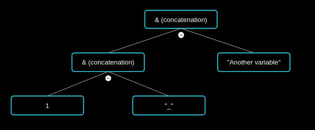

# Excel Formula Calculation Engine
A pure C library that works as an interface to compute Excel formulas, given a data context.

The real purpose of this library is to be used in other contexts than just spreadsheets. Of course, it aims at being capable of such thing, but again, my interest in making it simply is not about spreadsheets. In fact, it is to allow integration of variable based calculations in other programmes, using formulas defined by users. That's why I chose Excel, since it is the most commonly used CAS on the market, and its syntax is well-known or well-documented.

I'll detail here the way it is intended to work.

## Table of contents
- [A three steps workflow](#a-three-steps-workflow)
  - [Creation of the context](#creation-of-the-context)
  - [Computation of a formula](#computation-of-a-formula)
    - [Formula parsing](#formula-parsing)
      - [1. Recognising the tokens included](#1-recognising-the-tokens-included)
      - [2. Injecting variable values](#2-injecting-variable-values)
      - [3. Creating the execution tree](#3-creating-the-execution-tree)
    - [Formula processing](#formula-processing)
- [Building the project](#building-the-project)
  - [Project dependencies](#project-dependencies)
- [Usage tips!](#usage-tips)

## A three steps workflow

Detailed below is the workflow followed by the library.

[](https://mermaid.live/edit#pako:eNpFj8FOwzAMhl_F8qlI3Qv0gLS18ACMG-Fgpe4arUkqx2Ggae9O2nXgk-Xv_2T7ijb2jA0OU7zYkUThvTMBSu2rVpjUxQBxAB0ZbAzK3_q0cdjtnuFQ7dMZhihbws9Z_yRagM8TbcphVdqP1_sUZpLkwunzTtuVdv9UouW0BGq4OB0f--GLpsxps7rVeqneWLOE9QrhlKfHmVijZ_Hk-vLldZkZLCHPBpvS9iRngybcSo6yxuNPsNioZK4xzz0pd45OQh6bgabEt1_3vmON)

### Creation of the context
The context is a set of variables that can be called for in the formula to be calculated.

Here's an example of how to create your own context:
```c
#include "excel_formula_calculation_engine.h"

formula_variable *variables[3] = {
        {
            "A1",
            &((void)1), // important that this is a pointer!
            EFCE_NUMBER // constant defined in the included header file
        },
        {
            "B1",
            &((void)"Another variable"),
            EFCE_STRING // same here
        }
};

// Notice that the memory of the context will not be altered by the engine.
// That means that if you allocate memory, you will bre responsible for freeing it too.
```

Here the example used cell-like identification names, but you can basically set whatever you like, as long as it remains alphanumerical and upper-case.


For the second value, it is very important that you provide a pointer, specifically of void, as the processor will then cast it back as the appropriate type, using the third value.

The third value tells what the variable type should be. It should be one of the following: (in case you wondered, the `EFCE_` prefix is there just to avoid conflicts with other constants as much as possible)
- `EFCE_NUMBER`; meaning it should be interpreted as a number (will be cast as a `double`).
- `EFCE_RATE`; meaning it should be interpreted as a percentage (will be cast as a `double` and applied a E-2).
- `EFCE_DATE`; meaning it should be interpreted as a UNIX timestamp (will be cast as a `long`).
- `EFCE_STRING`; meaning it should be interpreted as a pointer of char (will be cast as a `char *`).

### Computation of a formula
Once your context is ready, you can call the `compute_formula` function to calculate its result with the context you've just set up.

Here's the next part of the first example:
```c
// Still including the `excel_formula_calculation_engine` header.
#include <stdio.h>

char *concatenation = (char *)compute_formula(variables, "=A1&\"_\"&B1"); // =A1&"_"&B1
printf(concatenation);

// Output:
// 1_Another variable
```

#### Formula parsing
The formula parsing is one of the most crucial steps in the process. It consists in three things:

##### 1. Recognising the tokens included
If we take back our formula `=A1&"_"&B1`, the tokens here are:
- `A1`, which corresponds to our first variable
- `&`, which is the concatenation operator
- `"_"`, a value which is not predeclared (presumably a constant).
- `&`, the concatenation operator again
- `B1`, our second value.

Of course, parsing the formula will not succeed if the formula is incorrect.

##### 2. Injecting variable values
This step consists in replacing the variable tokens by their actual value in the context.

On our example again, here's what our tokens would look like after this step:
- `1`, which corresponds to our first variable
- `&`, which is the concatenation operator
- `"_"`, a value which is not predeclared (presumably a constant).
- `&`, the concatenation operator again
- `"Another variable"`, our second value.

Of course, injecting the values will not succeed if they don't exist in the context.

##### 3. Creating the execution tree
The execution tree is what defines the execution order of the different operands in the formula. It is indeed affected by operator's priority, whether they are regular (unary or binary) operators, or actual excel functions.

In our case, this is what the execution tree should be:


#### Formula processing
Once all preliminary tasks accomplished, the result of the formula can finally be computed, using a DFS algorithm on the execution tree.

Here's what it would give on our example:


## Building the project
In order to build the project on your own, you are going to need `make`.

More specifically, you have three options:
- The `make` command, at the root of the project, which will simply compile a version of the library as a shared object (.so) out in the `bin` folder.
- The `make tests` command, at the root too, which will build the library, like the previous command, but the tests also, and start executing them.
- The `make install` command, at the root, which will build the library, and move it to your `/usr/local/lib/` directory, enabling you to use it in your projects.

> **NOTE:**  
> The `make install` needs access to a directory owned by the root user, therefore it will need root permissions to work. Once installed, to include it in your project, add the `-lefce` option when compiling. If it doesn't work, try to verify that your linker searches in your `/usr/local/lib` directory and add it in your library search path if it isn't.
> 
> Also, this command is platform specific, contrarily to the two preceding ones. Sorry to put it that way, but as I don't use Windows on a regular basis, I will not document a way to install the library on that platform for now, so you will have to install it by yourself.

### Project dependencies
Of course, the project depends on **Make**, but also on **Docker**, so you will need to have those two packages installed on your machine.

## Usage tips!
Those tips will allow you to make a better use of the library.

1. Choosing the right order for your formula variables:  
As you might have noticed, there is no mention of a system to access rapidly each variable within the context. That means the accession is actually sequential, looking for each value one after the other. It is made this way because when creating the library, dealing with huge amounts of formula variables wasn't a key element. So basically, if you're using lots of variables for your formula(s) and your calculations become slow, try to reorganise them, so that the most frequently used ones can be accessed rapidly by putting them at the beginning of the array.
